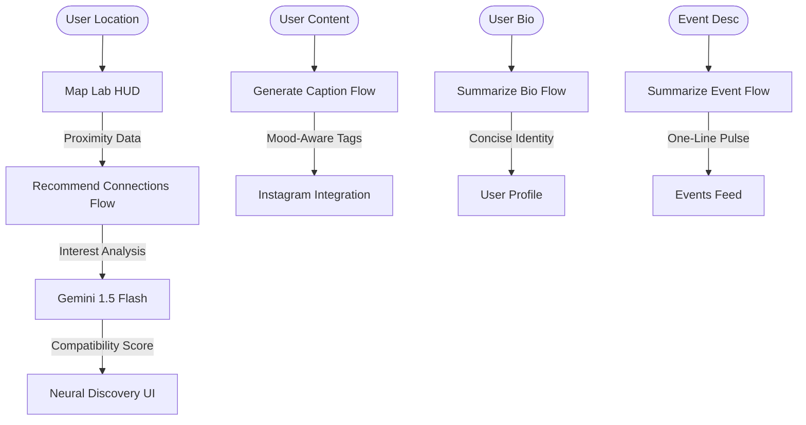

# 🌐 GeoSocial: Reality Unlocked

[](https://nextjs.org)
[](https://react.dev)
[](https://firebase.google.com)
[](https://firebase.google.com/docs/genkit)
[](#)

**GeoSocial** is a futuristic, AI-powered location-based social ecosystem. Built with a **Neural Discovery Engine** and high-fidelity **Map Lab** telemetry, GeoSocial bridges the gap between digital interaction and real-world connection. It empowers users to discover nearby "nodes" (people), join local "squads" (communities), and capture real-time "signals" (stories).

---

## 📸 Application Preview

### 🗺️ Map Lab Telemetry

*The Map Lab HUD provides real-time geocoded signals, animated route mapping, and proximity alerts using high-contrast laboratory filters.*

### ⚡ Neural Discovery Dashboard

*The Dashboard utilizes the Neural Match engine to rank nearby connections based on shared interests and proximity telemetry.*

---

## 🧠 AI Neural Architecture & Pipeline

GeoSocial leverages **Genkit v1.x** to power a multi-flow intelligence architecture for social matchmaking and content optimization:



### 👥 Intelligence Flows
1. **Networking Agent (`RecommendConnections`)**: Analyzes neighborhood meshes to rank nearby profiles based on shared interests and proximity, providing detailed "match reasons."
2. **Identity Agent (`SummarizeUserProfileBio`)**: Compresses complex user personas into concise, one-sentence "Neural Identities" for quick discovery.
3. **Pulse Agent (`SummarizeEventDescription`)**: Generates rapid summaries of local events to ensure users can scan activities in high-density urban environments.
4. **Creator Agent (`GenerateInstaCaption`)**: Analyzes post context to generate high-engagement social media captions and trending hashtags.

---

## 🛠️ Technical Stack & Dependencies

### 💻 Frontend & UI
- **Framework**: Next.js 15 (App Router)
- **Library**: React 19
- **Styling**: Tailwind CSS with **Glassmorphism Design System**
- **Components**: Radix UI & ShadCN UI
- **Animations**: Framer Motion & CSS Keyframes
- **Icons**: Lucide React

### ⚙️ Backend & Infrastructure
- **Platform**: Firebase (Firestore & Authentication)
- **AI Engine**: Firebase Genkit 1.x
- **LLM**: Gemini 1.5 Flash (via @genkit-ai/google-genai)
- **State Management**: React Hooks & Context

---

## 📂 Project Structure

```bash
GeoSocial/
│
├── src/
│   ├── ai/                   # Genkit AI Flows & Configuration
│   │   ├── flows/            # Business logic for AI agents
│   │   └── genkit.ts         # Genkit initialization
│   ├── app/                  # Next.js App Router (Pages & Layouts)
│   │   ├── (auth)/           # Authentication screens
│   │   ├── map/              # Map Lab HUD interface
│   │   ├── chat/             # Signal messaging system
│   │   └── reels/            # Short-form story feed
│   ├── components/           # Atomic UI & Shared components
│   │   └── ui/               # ShadCN primitive components
│   ├── firebase/             # Firebase SDK & Hook wrappers
│   └── lib/                  # Centralized Mock Data & Utilities
│
├── public/                   # Static assets & Telemetry textures
├── .env                      # Secrets & API Keys (gitignored)
├── tailwind.config.ts        # Theme & Glassmorphism config
└── README.md                 # Project Documentation
```

---

## ⚙️ Installation & Setup

### 1️⃣ Clone the Repository
```bash
git clone https://github.com/YourUsername/GeoSocial.git
cd GeoSocial
```

### 2️⃣ Environment Configuration
Create a `.env` file in the root directory:
```ini
GOOGLE_GENAI_API_KEY=your_gemini_api_key
NEXT_PUBLIC_FIREBASE_API_KEY=your_firebase_key
# ... add other Firebase config vars
```

### 3️⃣ Installation & Development
Install dependencies and run the development server:
```bash
npm install
npm run dev
```
Open **`http://localhost:9002/`** to enter the GeoSocial sector.

---

## 📈 Use Cases & Impact

- 🤝 **Hyper-Local Networking**: Find collaborators and friends within 500 meters.
- 🏙️ **Urban Exploration**: Use the Map Lab to discover "hidden nodes" and trending zones.
- 📡 **Real-Time Signal Sharing**: Broadcast short-form stories geoclocked to your current location.
- 🛡️ **Network Security**: AES-256 node encryption and AI-moderated safety status.

---

## ⭐ Support & Contributions

Join the evolution!
1. Fork the project.
2. Create your Signal branch (`git checkout -b feature/NewSignal`).
3. Commit your nodes (`git commit -m 'Add NewSignal'`).
4. Push to the mesh (`git push origin feature/NewSignal`).
5. Open a Pull Request.

---

### 📌 Development Lead
**YOUR NAME**  
[GitHub Profile](https://github.com/YourUsername)

---
*Developed with ❤️ to unlock reality and connect the world, one coordinate at a time.*